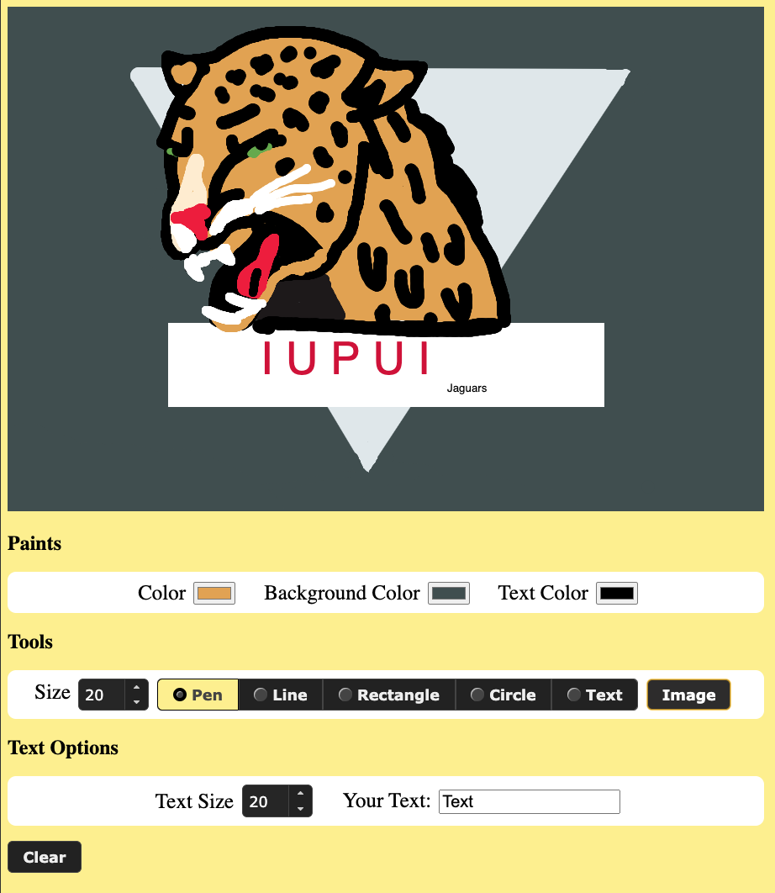

# Drawing-Web-App

This web app is a simple drawing program made using HTML, JavaScript, and CSS for the web. Users are able to create and save drawings using the canvas provided for them. This app was created as a simple 2D graphics demonstration for my _Introduction to 3D Game Graphics_ class at IUPUI. We were tasked with creating some sort of artwork or graphic with the basic tools provided from a language of our choice such as JavaScript, Java, or Python. I figured I could go above and beyond by giving anyone the ability to do this through some very simple tools in a drawing web app!

## Running the Application
The application can be run on a local web server hosting the main directory of the project.

## Using the Application
There are three main tool bars that the user has access to, with the first being the Paints section. The Color input changes the color for the Pen, Line, Rectangle, and Circle tools. The Background Color input changes the color of the background. The Text Color input changes the color of the user’s texts. 

In the Tools section, the user can choose the size of the Pen and Line strokes. While using the Line tool, the program takes a starting input when the user presses down on the mouse, and draws a line to wherever they let go from. The Rectangle tool is similar, but it draws a rectangle to the ending point instead of a straight line. The Circle tool is similar to the Pen tool, but it gives a more spotted stroke when brushing quickly. The Image button displays a sample image that I drew using this drawing program. It is best viewed when first arriving on the page. 

The Text Options section allows users to input a text size and their own string of text. When the user selects the Text radio in the Tools section. The user can click anywhere on the canvas to display their text that they typed into the Your Text input of the Text Options section.

Users can even save their drawings by right clicking on the canvas and clicking Save Image As from the dropdown menu. If users want to create a brand new drawing, the Clear button clears the entire canvas.

